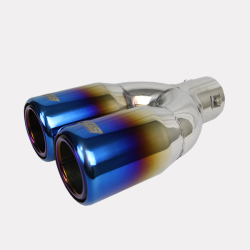
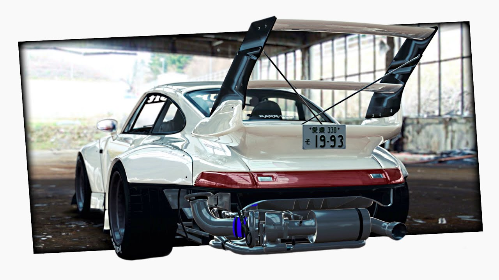

# Sistema de escape

### ¿Por qué está de moda?
Modificar el sistema de escape está de moda ya que no es algo o costoso según el tipo de modificación. La fama detrás de esta customización está en el sonido, generalmente uno más fuerte y que destaca calidad, aunque no siempre es el caso.
### Funcionalidad
La función de esta modificación son dos, mejorar el rendimiento y/o mejorar la estética del propio auto.
- Mejor rendimiento: Si el escape antiguo está desgastado o tiene mucho uso, cambiarlo por uno nuevo puede mejorar la salida de gases y aumentar la potencia.
- Mejor estética: Cambiar el escape por uno más atractivo puede darle un aspecto más personalizado al vehículo.  

https://www.autocasion.com/actualidad/reportajes/las-modas-en-los-tubos-de-escape-ahora-se-ven-ahora-no-se-ven
# Rines

### ¿Por qué están de moda?
En el mundo de los autos, los rines de estos suelen ser la principal modificación estética por la manera en la que cambia "radicalmente" la imagen del auto.
### Rines más facheros
Los rines que más se suelen ver y por lo que se consideran una tendencia, son los de color negro. Y en base al texto anterior, "¿Por qué están de moda?", estos rines de color negro están de moda ya que dan un estilo más deportivo y no necesariamente dífícil de conseguir, sino todo lo contrario.
# Filtros de aire

### Funcionalidad
Un filtro de aire limpio está diseñado para capturar la suciedad y partículas del aire exterior, evitando que lleguen a la cámara de combustión y reduciendo la probabilidad de que tengas que hacer frente a una elevada factura de reparación.

# Alerones

Acerca de los alerones se podrían mencionar dos aspectos y razones fundamentales del porqué son una tendencia; la funcionalidad que tienen y su estética.
- Con respesto a la **funcionalidad**, los alerones se utilizan para reducir y optimizar la resistencia que ofrece el coche al aire, así como para incrementar la fuerza con la que el vehículo se adhiere al suelo.
- Entre los mejores alerones, hablando del apartado  **estético**, se encuentran los de los módelos modificados porsche, los RWB (Rauh-Welt Begriff, que significa "Concepto de mundo duro"). Aunque no se destaquen por su efectividad aerodinámica, resaltan por su agresivo diseño poco ordinario, además de la escacez de este tipo de modelo en el mercado.

https://www.way.com/es/blog/what-is-rwb-porsche/